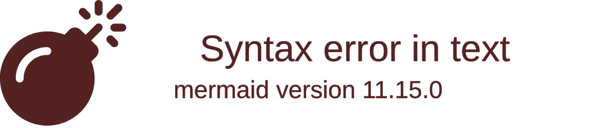
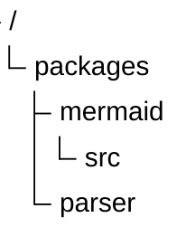
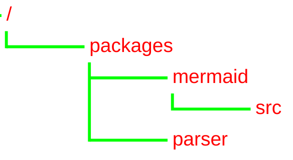

# TreeView Diagram (v11.14.0+)

## Introduction

A TreeView diagram is used to represent hierarchical data in the form of a directory-like structure, with file-type icons, connector lines, and optional annotations.

## Syntax

The structure of the tree depends only on indentation. Labels can be **bare** (unquoted) or **quoted** (for names containing spaces).

- Directories are indicated by a trailing `/` on the label — they get a folder icon and bold text.
- Files are auto-detected by extension and assigned a matching icon.
- Quoted labels (`"my file"`) support spaces in names.

```
treeView-beta
    my-project/
        src/
            index.js
        package.json
        README.md
```

Quoted labels (backward compatible):

```
treeView-beta
    "my project"
        "folder with spaces"
            "file.js"
```

## Box-Drawing Input

As an alternative to indentation, you can use box-drawing characters to define the tree structure. The parser auto-detects the format — no extra keyword or config is needed. This is how most file tree diagrams are drawn already, so you can turn those into Mermaid diagrams with very little effort.

Both standard (`├──`, `└──`, `│`) and heavy (`┣━━`, `┗━━`, `┃`) Unicode variants are supported.



All annotations work the same way — just append them after the label:


Depth is inferred from the column position of the branch character, so deeper nesting works naturally:


> **Note:** If a parse error occurs, line numbers in the error message refer to your original input. Tab characters are automatically expanded to spaces.

## Annotations

### Highlighting with :::class

Annotate a node with `:::className` to apply a CSS class. A built-in `highlight` class is provided:


### Inline descriptions with `##`

Add a visible description after `##` — rendered next to the label in italic:


### Icon overrides with icon()

Override the auto-detected icon with `icon(name)`:


### Combined annotations

Annotations can be combined in any order:


## Comments

Use `%%` for invisible comments (standard Mermaid convention):

```
treeView-beta
    %% Generated files — do not edit
    src/
        generated/
        index.js
```

## Examples

Basic with quoted labels:



With custom config:



## Config Variables

| Property      | Description                       | Default Value |
| ------------- | --------------------------------- | ------------- |
| rowIndent     | Indentation for each row          | 10            |
| paddingX      | Horizontal padding of row         | 5             |
| paddingY      | Vertical padding of row           | 5             |
| lineThickness | Thickness of the line             | 1             |
| showIcons     | Whether to show file/folder icons | true          |

### Theme Variables

| Property         | Description                    | Default Value        |
| ---------------- | ------------------------------ | -------------------- |
| labelFontSize    | Font size of the label         | '16px'               |
| labelColor       | Color of the label             | 'black'              |
| lineColor        | Color of the line              | 'black'              |
| iconColor        | Color of file-type icons       | '#546e7a'            |
| descriptionColor | Color of `##` description text | '#6a9955'            |
| highlightBg      | Highlight background fill      | rgba(255,193,7,0.15) |
| highlightStroke  | Highlight border stroke        | #ffc107              |

## Supported Icons

Icons are auto-detected from file extensions and known filenames:

| Extension / Filename  | Icon       |
| --------------------- | ---------- |
| `.js`, `.mjs`, `.cjs` | javascript |
| `.ts`                 | typescript |
| `.jsx`, `.tsx`        | react      |
| `.py`                 | python     |
| `.json`               | json       |
| `.md`, `.mdx`         | markdown   |
| `.html`, `.htm`       | html       |
| `.css`, `.scss`       | css        |
| `.yaml`, `.yml`       | yaml       |
| `.sh`, `.bash`        | terminal   |
| `.sql`, `.db`         | database   |
| `.lock`               | lock       |
| `.gitignore`          | git        |
| `Dockerfile`          | docker     |
| `Makefile`            | terminal   |
| Directories (`/`)     | folder     |
| Unknown extension     | file       |
